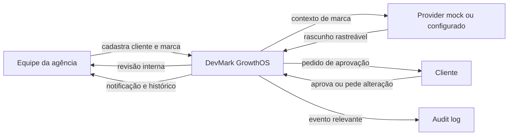
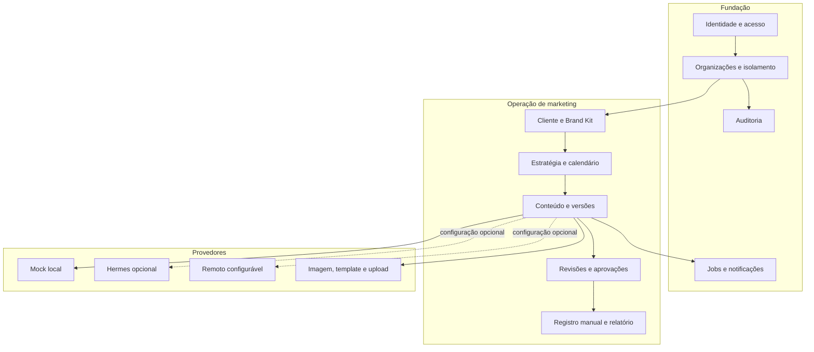

# Visão geral do DevMark GrowthOS

**Status:** base de produto para a versão 1.0  
**Produto:** DevMark GrowthOS  
**Orquestrador central:** Growth Agent  
**Primeiro cenário real:** clínica veterinária, com arquitetura reutilizável por outros segmentos

## 1. Propósito

O DevMark GrowthOS é a central operacional de marketing, desenvolvimento e automação da DevMark IA. Ele reúne, em um único fluxo, o cadastro da marca, o planejamento, a produção assistida por inteligência artificial, a revisão humana, a aprovação do cliente, as notificações e o histórico auditável.

O produto nasce para resolver um problema simples: hoje, informações da marca, versões de conteúdo, comentários e aprovações podem ficar espalhados em conversas e arquivos. O GrowthOS oferece uma fonte única de verdade e deixa claro o que está sendo produzido, quem precisa agir e o que já foi aprovado.

O sistema **não é o site institucional da DevMark IA**. O site público continua no repositório `bugijo/DevMark-ia` e em `devmarkia.com.br`. Este projeto é um produto separado, no repositório `bugijo/DevMark-GrowthOS`, destinado futuramente a `app.devmarkia.com.br`.

## 2. Visão do produto

> Ser o sistema operacional de crescimento digital que conecta a equipe da agência, seus clientes e uma equipe de agentes de IA, sem abrir mão de controle humano, segurança e consistência de marca.

Na visão final, o cliente não recebe apenas postagens. Ele acessa uma operação coordenada pelo Growth Agent, com agentes especializados em auditoria, estratégia, conteúdo, visual, vídeo, anúncios, CRM, atendimento, análise, conformidade e desenvolvimento.

Na versão 1.0, a prioridade é menor e deliberada: provar o fluxo completo de criação e aprovação para a clínica piloto, com dados reais no banco, isolamento entre organizações e funcionamento sem API paga.

## 3. Pessoas atendidas

### Equipe da agência

- administra organizações, clientes e usuários;
- registra Brand Kits, públicos, serviços e regras;
- cria estratégias, calendários, conteúdos e versões;
- faz a revisão interna antes de envolver o cliente;
- acompanha pendências, notificações, publicações manuais e resultados básicos.

### Cliente proprietário ou revisor

- acessa apenas a empresa à qual foi vinculado;
- vê rapidamente o que está pendente;
- revisa o conteúdo e seu contexto em poucos toques;
- aprova, pede alterações, reprova ou deixa para depois;
- acompanha histórico, calendário, notificações e resultados resumidos.

### Pessoa somente leitora

- consulta informações permitidas;
- não cria, altera, aprova ou publica conteúdo.

## 4. Resultado esperado

O primeiro ciclo é bem-sucedido quando uma pessoa consegue entrar, operar dentro de uma organização, cadastrar um cliente e seu Brand Kit, criar um conteúdo por provider mock, submetê-lo ao cliente, receber a decisão, notificar a equipe e consultar todo o histórico no audit log.

## 5. Princípios obrigatórios

1. **Humano no controle.** Não há publicação automática nem gasto de mídia na versão 1.0. Conteúdo veterinário ou de saúde exige revisão profissional.
2. **Multiempresa desde o domínio.** A autorização e o isolamento são validados no backend; filtros visuais não constituem segurança.
3. **Simples para quem usa.** A interface é mobile first, em português do Brasil, com poucos botões, linguagem humana, estados vazios úteis e próximo passo evidente.
4. **Tudo importante é rastreável.** Login relevante, alteração de permissão, criação de versão, mudança de estado, aprovação e operação de integração produzem registro de auditoria.
5. **A marca orienta a criação.** O Brand Kit e os presets são contexto obrigatório; consistência vale mais do que volume.
6. **IA é substituível.** Casos de uso dependem de contratos de provider, não de um fornecedor específico. O provider mock é uma opção de primeira classe.
7. **Falhas são visíveis e recuperáveis.** Jobs têm estado, tentativas, timeout e logs; a interface informa progresso e falhas sem jargão.
8. **Segurança e privacidade por padrão.** Segredos ficam fora do código, os dados têm finalidade definida e o projeto é preparado para os direitos previstos na LGPD.
9. **Evolução incremental.** A primeira entrega é um fluxo vertical real, não um conjunto de telas desconectadas.

## 6. Capacidades do produto

## 7. Limites de autonomia

As ações externas são classificadas desde o início, mesmo quando ainda não estão implementadas:

- **leitura automática autorizada:** poderá consultar métricas e estados em versões futuras;
- **escrita com aprovação:** publicação, resposta, campanha e qualquer alteração financeira sempre exigem aprovação inicial;
- **escrita automática controlada:** somente em versões futuras, com política explícita, limites, logs, alerta, reversão e bloqueio de emergência.

Na versão 1.0, integrações sociais e de anúncios existem apenas como contratos, configurações seguras e mocks. O e-mail transacional e as notificações internas podem ser usados para o fluxo de aprovação. A publicação é apenas registrada manualmente.

## 8. Indicadores de validação da versão 1.0

Não serão inventadas métricas de negócio. A validação inicial usa evidências observáveis:

- o fluxo vertical é concluído de ponta a ponta por agência e cliente;
- nenhum usuário acessa dados de outra organização ou empresa;
- cada decisão aponta para o usuário, a data e a versão exata;
- o sistema inicia por Docker Compose e funciona com provider mock;
- testes automatizados, lint e validações passam;
- o portal de aprovação é utilizável em celular;
- uma pessoa diferente da autora consegue instalar o projeto com a documentação.

## 9. Vocabulário comum

| Termo | Significado no GrowthOS |
| --- | --- |
| Organização | Limite principal de dados e acesso; normalmente representa a operação da agência ou uma conta isolada. |
| Empresa/cliente (`business`) | Marca atendida dentro de uma organização. Um membro cliente fica limitado às empresas às quais recebeu acesso. |
| Brand Kit | Fonte estruturada de identidade, linguagem, regras, contatos e referências de uma empresa. |
| Preset visual | Conjunto reutilizável de regras para um formato e objetivo visual. |
| Conteúdo | Unidade editorial que percorre estados de criação, revisão, aprovação e publicação manual. |
| Versão | Fotografia imutável do texto e dos atributos revisáveis em determinado momento. |
| Aprovação | Decisão sobre uma versão específica, nunca sobre um conteúdo mutável de forma genérica. |
| Provider | Adaptador substituível para texto, imagem, e-mail ou outro serviço externo/local. |
| Job | Trabalho assíncrono persistido, executado pelo worker com tentativas controladas. |
| Audit log | Registro imutável de quem fez o quê, quando, em qual organização e sobre qual recurso. |

## 10. Documentos relacionados

- [Escopo da versão 1](./01-escopo-versao-1.md)
- [Roadmap](./02-roadmap.md)
- [Arquitetura](./03-arquitetura.md)
- [Modelo de dados](./04-modelo-de-dados.md)
- [Fluxos e UX](./05-fluxos-e-ux.md)
- [Agentes e responsabilidades](./06-agentes-e-responsabilidades.md)

