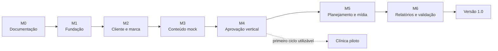

# Roadmap do DevMark GrowthOS

## 1. Como ler este roadmap

O roadmap é orientado a resultados e critérios de saída, não a datas arbitrárias. Cada marco termina com software demonstrável, testes e documentação. Uma etapa pode preparar contratos para o futuro, mas não deve ativar uma integração que esteja fora do escopo vigente.

Prioridades:

- **P0:** bloqueia o fluxo vertical ou a segurança; obrigatório antes da clínica piloto;
- **P1:** obrigatório para declarar a versão 1.0 completa;
- **P2:** melhoria planejada para versão posterior;
- **P3:** visão futura, ainda sem compromisso de implementação.

## 2. Sequência de entrega da versão 1.0

### M0 — Auditoria, decisões e documentação

**Objetivo:** garantir que o produto nasce no repositório correto e com limites comuns.

Entregas P0:

- confirmar o repositório `DevMark-GrowthOS` e manter `DevMark-ia` intocado;
- documentar visão, escopo, arquitetura, dados, UX, agentes, segurança, testes, operação, riscos e integrações;
- registrar a decisão de monorepo e monólito modular;
- definir papéis, transições, eventos auditáveis, backlog e critérios de aceite;
- criar README, AGENTS, CONTRIBUTING, CHANGELOG e exemplo de ambiente.

**Critério de saída:** documentação revisável existe antes da implementação e não há decisão essencial escondida apenas no código.

### M1 — Fundação executável

**Objetivo:** criar uma base local e de CI reproduzível.

Entregas P0:

- monorepo com frontend, backend, worker, compartilhados, infraestrutura e testes;
- Next.js/TypeScript/Tailwind e FastAPI/Python;
- PostgreSQL, Alembic e Docker Compose;
- login seguro, recuperação preparada, organizações, memberships e papéis;
- isolamento multiempresa no backend;
- logs estruturados, erros consistentes e audit log;
- lint, tipos, testes e CI.

**Critério de saída:** uma instalação limpa sobe pelo procedimento documentado; login e negação entre tenants têm testes automatizados.

### M2 — Cliente, Brand Kit e onboarding

**Objetivo:** registrar contexto suficiente para criar conteúdo coerente.

Entregas P0:

- empresa cliente e responsáveis;
- Brand Kit básico, serviços, públicos e objetivos;
- vínculos de acesso do cliente por empresa;
- dados de demonstração da clínica veterinária.

Entregas P1:

- Brand Kit completo;
- presets visuais;
- upload protegido de logos e referências;
- preferências de notificação e checklist de onboarding.

**Critério de saída:** a agência conclui o cadastro da clínica e o cliente só consegue consultar a própria empresa.

### M3 — Conteúdo e providers

**Objetivo:** produzir um conteúdo rastreável sem serviço pago.

Entregas P0:

- contratos de provider e provider mock determinístico;
- conteúdo e primeira versão;
- geração mock de ideia/legenda com contexto do Brand Kit;
- identificação do provider e audit log.

Entregas P1:

- estratégia e plano editorial;
- calendários;
- roteiros e prompts visuais;
- modos `TEMPLATE`, `AI_IMAGE`, `HYBRID` e `MANUAL`;
- upload e biblioteca de mídia básica;
- `HermesProvider` opcional e configuração de provider remoto;
- jobs persistidos com retry, timeout e logs.

**Critério de saída:** o caminho padrão gera e salva conteúdo sem chave externa; indisponibilidade de provider opcional não derruba o sistema.

### M4 — Revisão, aprovação e notificação

**Objetivo:** fechar o primeiro fluxo vertical real.

Entregas P0:

- submissão para revisão interna;
- liberação para revisão do cliente;
- portal mobile de pendências;
- aprovação pelo cliente sobre a versão exata;
- pedido de alteração com comentário e nova versão;
- notificação interna para agência e cliente;
- audit log de cada transição.

Entregas P1:

- reprovação e “salvar para depois”;
- comentários e histórico de versões;
- contador de pendências;
- e-mail transacional, urgência, lembrete e preferências;
- proteção específica para conteúdo veterinário/saúde.

**Critério de saída:** agência e cliente concluem o fluxo vertical de ponta a ponta e a trilha informa ator, horário, versão e decisão.

### M5 — Planejamento, calendário e operação manual

**Objetivo:** completar o trabalho editorial da 1.0 sem publicação automática.

Entregas P1:

- estratégia revisável e calendário editorial;
- visualização semanal/mensal;
- conteúdo aprovado no calendário;
- marcação manual como agendado e publicado;
- falha operacional e arquivamento;
- painel de pendências e notificações.

**Critério de saída:** a equipe acompanha o ciclo editorial sem planilha paralela e sem conectar redes sociais.

### M6 — Relatórios e gate da versão 1.0

**Objetivo:** validar segurança, qualidade e operação da clínica piloto.

Entregas P1:

- relatório básico baseado em dados manuais;
- testes unitários, integração e ponta a ponta;
- testes explícitos de isolamento e papéis;
- acessibilidade, responsividade e estados de falha;
- backup/restore e procedimentos operacionais documentados;
- dados demo, revisão de segredos e auditoria de dependências;
- evidências dos critérios de aceitação.

**Critério de saída:** todos os gates da seção 4 estão verdes e as limitações conhecidas estão documentadas.

## 3. Backlog priorizado da versão 1.0

| ID | Prioridade | Épico | Entrega | Dependência |
| --- | --- | --- | --- | --- |
| V1-001 | P0 | Fundação | Compose, banco, migrações e health checks | M0 |
| V1-002 | P0 | Identidade | Login, sessão segura e usuário demo | V1-001 |
| V1-003 | P0 | Tenancy | Organizações, memberships, escopo de empresa e testes negativos | V1-002 |
| V1-004 | P0 | Permissões | Papéis oficiais e autorização no backend | V1-003 |
| V1-005 | P0 | Governança | Audit log imutável e eventos essenciais | V1-003 |
| V1-006 | P0 | Cliente | CRUD de empresa cliente | V1-004 |
| V1-007 | P0 | Marca | Brand Kit básico | V1-006 |
| V1-008 | P0 | IA | Contratos e provider mock | V1-007 |
| V1-009 | P0 | Conteúdo | Conteúdo, versão inicial e geração mock | V1-008 |
| V1-010 | P0 | Aprovação | Revisão interna e revisão do cliente | V1-009 |
| V1-011 | P0 | Portal | Aprovação mobile pelo cliente | V1-010 |
| V1-012 | P0 | Notificação | Notificação interna e contador | V1-010 |
| V1-013 | P0 | Qualidade | Teste E2E do fluxo e do isolamento | V1-011, V1-012 |
| V1-014 | P1 | Onboarding | Serviços, públicos, objetivos e responsáveis | V1-007 |
| V1-015 | P1 | Marca | Brand Kit completo, presets e uploads | V1-014 |
| V1-016 | P1 | Planejamento | Estratégia e calendário editorial | V1-009 |
| V1-017 | P1 | Conteúdo | Roteiros, prompts, comentários e histórico | V1-009 |
| V1-018 | P1 | Visual | Template, híbrido, manual e abstração de imagem | V1-015 |
| V1-019 | P1 | Worker | Jobs, locking, tentativas, timeout e logs | V1-001 |
| V1-020 | P1 | Providers | Hermes opcional e remoto configurável | V1-008, V1-019 |
| V1-021 | P1 | Notificação | E-mail, preferências e lembretes | V1-019 |
| V1-022 | P1 | Operação | Marcação manual de publicação | V1-016 |
| V1-023 | P1 | Relatório | Resumo básico sem métricas inventadas | V1-022 |
| V1-024 | P1 | Segurança | Rate limit, uploads, revisão LGPD e dependências | M1–M5 |
| V1-025 | P1 | Entrega | CI, seeds, acessibilidade, operação e aceite final | Todos |

## 4. Gates da versão 1.0

Uma release candidata só avança quando:

| Gate | Condição de aprovação |
| --- | --- |
| Produto | Fluxos obrigatórios demonstrados com dados persistidos, sem telas isoladas |
| Segurança | Testes de acesso cruzado falham de forma segura; segredos não estão no Git |
| Conteúdo sensível | Revisão profissional exigida para veterinária/saúde |
| Qualidade | Lint, tipos, testes, build e migrações passam no CI |
| Operação | Compose inicia; health checks e worker funcionam; backup/restore foi ensaiado |
| Independência | Caminho principal funciona com provider mock e sem API paga |
| UX | Aprovação é concluída em viewport móvel, com estados de carregamento/erro/vazio |
| Auditoria | Decisões e mudanças relevantes são recuperáveis por organização e recurso |
| Documentação | Uma pessoa diferente consegue instalar, executar e testar |

## 5. Evolução após a versão 1.0

### 1.1 — Operação interna

Biblioteca de templates, duplicação de campanhas, tarefas recorrentes, resumo diário, calendário aprimorado, relatórios exportáveis, gestão de equipe, custos por cliente, dashboard da agência e importação de conteúdo antigo.

### 2.0 — Redes sociais

Conexões oficiais com Instagram, Facebook, Meta Business, Google Business Profile e YouTube básico; publicação programada; métricas automáticas; mídia multiformato; acompanhamento de falhas. A aprovação final continua obrigatória.

### 2.5 — CRM e relacionamento

Leads, funil, e-mail transacional ampliado, WhatsApp Business oficial, Telegram, segmentação, follow-up, recuperação de clientes e pedidos de avaliação, sempre respeitando consentimento e preferências.

### 3.0 — Tráfego pago

Meta Ads, Google Ads, contas gerenciadoras, campanhas, criativos, testes A/B, conversões, limites de orçamento, alertas e aprovação obrigatória. Nenhuma mudança financeira será silenciosa.

### 4.0 — Autonomia controlada

Monitoramento contínuo, agentes colaborativos, otimização baseada em regras, metas, orçamento de IA, políticas por cliente, explicação de decisões, rollback e bloqueio de emergência.

### 5.0 — GrowthOS comercial

Onboarding self-service, cobrança, planos, white label, marketplaces, benchmarking anonimizado e autorizado, múltiplos idiomas, aplicativo móvel, API pública, parceiros, franquias e outras agências.

## 6. Dependências e riscos de sequência

- Aprovações dependem de versionamento imutável; não inverter essa ordem.
- UI multiempresa depende de autorização no backend; esconder menus não atende ao requisito.
- E-mail depende do worker, mas a notificação interna não deve depender do e-mail.
- Provider remoto depende de configuração segura; o mock é implementado primeiro.
- Relatório depende de publicação/métricas registradas; ausência de dados deve aparecer como ausência, não como zero inventado.
- Integrações oficiais dependem de OAuth, revisão das plataformas e escopos; pertencem a versões posteriores.
- A clínica piloto trabalha com tema de saúde; revisão profissional e restrições do Brand Kit são requisitos de produto, não detalhes editoriais.

## 7. Gestão de mudanças

Uma mudança de escopo deve:

1. apontar o requisito ou risco que a motivou;
2. indicar efeito no fluxo vertical, segurança e prazo;
3. atualizar este roadmap e o documento de escopo;
4. gerar ADR quando alterar uma decisão arquitetural relevante;
5. preservar o provider mock e a separação do site institucional.

