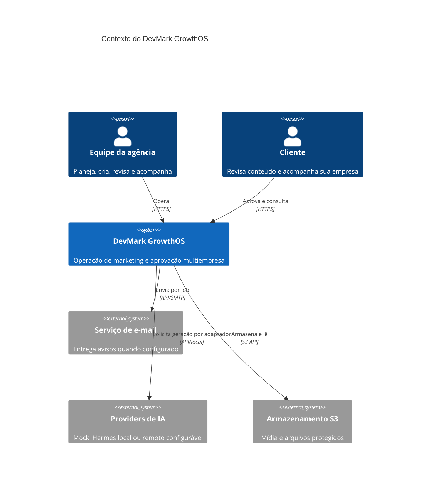
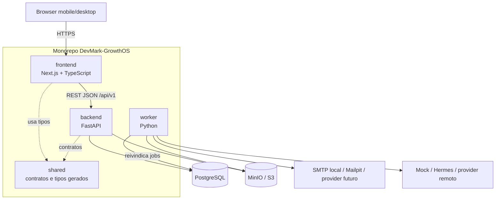
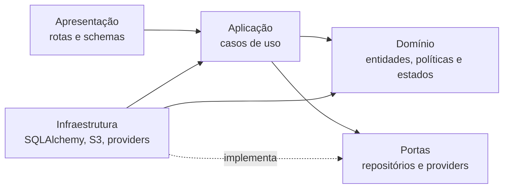
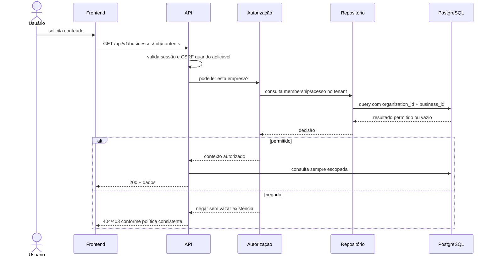

# Arquitetura da versão 1.0

## 1. Objetivos arquiteturais

A arquitetura deve permitir uma primeira entrega rápida sem comprometer os pontos que seriam caros de corrigir depois: isolamento multiempresa, autorização, histórico, troca de providers, trabalho assíncrono e auditabilidade.

As escolhas centrais são:

- monorepo separado do site institucional;
- frontend Next.js/TypeScript e backend FastAPI/Python;
- monólito modular no backend, com worker separado reutilizando domínio e serviços;
- PostgreSQL como fonte de verdade;
- armazenamento compatível com S3, com MinIO no ambiente local;
- providers acessados por portas e adaptadores;
- Docker Compose para desenvolvimento e validação local;
- provider mock obrigatório e integrações externas desativadas por padrão.

A decisão e suas alternativas estão registradas em [ADR-0001](./ADR/0001-monorepo-e-arquitetura.md).

## 2. Contexto do sistema



O site `devmarkia.com.br` e seu repositório `DevMark-ia` ficam fora deste contexto. Uma ligação futura pode direcionar usuários ao aplicativo, mas os códigos e ciclos de deploy permanecem separados.

## 3. Contêineres da solução



### Responsabilidades

| Componente | Faz | Não faz |
| --- | --- | --- |
| `frontend` | Renderiza painel/portal, valida interação, trata acessibilidade e chama a API | Não decide autorização nem acessa banco/providers diretamente |
| `backend` | Autentica, autoriza, valida, aplica casos de uso, persiste e expõe OpenAPI | Não executa tarefas demoradas dentro da requisição |
| `worker` | Reivindica jobs, executa providers/notificações, aplica retry e registra resultado | Não cria uma segunda regra de domínio divergente |
| `shared` | Mantém contratos estáveis, enums e tipos gerados/compartilhados | Não vira depósito de regras específicas de UI ou infraestrutura |
| PostgreSQL | Fonte transacional de verdade, tenancy, jobs e auditoria | Não é exposto diretamente ao navegador |
| S3/MinIO | Guarda mídia; fornece acesso temporário/autorizado | Não define permissões de negócio sozinho |

## 4. Estrutura do monorepo

```text
DevMark-GrowthOS/
├── frontend/          # aplicação Next.js e testes da interface
├── backend/           # API, domínio, serviços, adaptadores e migrações
├── worker/            # processo assíncrono e handlers de jobs
├── shared/            # contratos OpenAPI/tipos e convenções compartilhadas
├── infra/             # decisões e configuração operacional futura
├── docs/              # produto, arquitetura, operação e ADRs
├── scripts/           # automação de desenvolvimento, sem segredos
├── tests/             # integração e ponta a ponta entre aplicações
├── .github/           # CI e templates
└── docker-compose.yml
```

O frontend e o ecossistema Python mantêm suas dependências próprias. Comandos da raiz apenas orquestram tarefas comuns; não misturam runtimes artificialmente.

## 5. Arquitetura interna do backend

Cada módulo de negócio segue dependências orientadas para dentro:



- **Apresentação:** FastAPI, schemas Pydantic, parsing, códigos HTTP e mapeamento de erros.
- **Aplicação:** transações e casos de uso como `CreateBusiness`, `GenerateContent`, `SubmitForClientReview` e `DecideApproval`.
- **Domínio:** estados, transições, permissões contextuais e invariantes sem dependência de HTTP ou SDK externo.
- **Infraestrutura:** SQLAlchemy 2, Alembic, repositórios, hashing/sessão, S3 e adaptadores.

Módulos iniciais: `identity`, `organizations`, `businesses`, `brands`, `content`, `approvals`, `notifications`, `providers`, `jobs` e `audit`.

## 6. Autenticação, sessão e autorização

- Senhas usam Argon2id por biblioteca mantida; nunca são criptografadas ou logadas manualmente.
- A sessão usa token de curta duração em cookie `HttpOnly`, `Secure` em produção e `SameSite` compatível com o deploy.
- Requisições que mudam estado recebem proteção CSRF quando a autenticação por cookie se aplica.
- Recuperação e convite usam tokens aleatórios, de uso único, com hash persistido, propósito e expiração.
- Rate limiting protege login, recuperação e endpoints de maior custo.
- `SUPER_ADMIN` é uma capacidade de plataforma e seu uso deve ser excepcional e auditado.
- Todo caso de uso carrega um `ActorContext` com `user_id`, `organization_id`, empresas permitidas, papéis e `request_id`.
- O backend confere organização, escopo de empresa e ação; o frontend apenas melhora a experiência.

### Sequência de uma requisição multiempresa



O PostgreSQL pode receber defesa adicional por Row-Level Security no futuro. Na 1.0, o requisito mínimo é escopo obrigatório nos repositórios, chaves/constraints coerentes e testes de acesso cruzado; RLS não substitui a autorização da aplicação.

## 7. Persistência e transações

- Identificadores são UUIDs e timestamps são UTC; a interface converte para o fuso do usuário.
- Toda tabela de domínio multiempresa possui `organization_id`; entidades de cliente também possuem `business_id` quando aplicável.
- Alterações concorrentes usam versão/controle otimista onde uma sobrescrita seria perigosa.
- Conteúdo revisado é imutável em `content_versions`; uma correção cria nova versão.
- Aprovação referencia `content_version_id`, evitando aprovar dados que mudaram depois.
- Notificação interna, audit log e job decorrentes de um caso de uso são criados na mesma transação sempre que possível.
- Exclusão lógica é usada apenas quando retenção/histórico exigem; unicidade deve considerar registros ativos.
- Migrations Alembic são a única forma de evoluir o schema compartilhado.

O modelo detalhado está em [Modelo de dados](./04-modelo-de-dados.md).

## 8. Jobs e consistência assíncrona

A versão 1.0 usa a tabela `jobs`, sem exigir Redis. O worker:

1. busca um lote elegível;
2. reivindica registros atomicamente com `FOR UPDATE SKIP LOCKED`;
3. muda o estado para `RUNNING` e registra lease/timeout;
4. executa um handler idempotente;
5. marca `SUCCEEDED` ou agenda nova tentativa com backoff;
6. após o limite, marca `FAILED` e gera notificação operacional.

Estados de job: `PENDING`, `RUNNING`, `RETRY_SCHEDULED`, `SUCCEEDED`, `FAILED` e `CANCELLED`.

Cada job tem `organization_id`, tipo, payload mínimo, chave de idempotência, tentativas, `available_at`, erro sanitizado e timestamps. Segredos e textos sensíveis completos não entram no payload se puderem ser recuperados com autorização no momento da execução.

Redis e uma fila dedicada só serão adicionados quando volume ou latência comprovarem a necessidade; os handlers não devem depender da mecânica da tabela.

## 9. Providers e Growth Agent

Casos de uso dependem de interfaces internas, por exemplo:

- `TextProvider.generate(request) -> GenerationResult`;
- `ImageProvider.generate(request) -> MediaResult`;
- `NotificationProvider.send(request) -> DeliveryResult`;
- `StorageProvider.put/get_signed_url`.

Adaptadores possíveis são registrados por nome e capacidade. `MockTextProvider` e opções locais de template/upload são padrão no desenvolvimento. `HermesProvider` e providers remotos são opcionais e usam configuração segura.

O Growth Agent seleciona uma capacidade conforme tarefa, sensibilidade, disponibilidade, custo permitido e configuração da organização. Ele não recebe acesso irrestrito ao banco, não muda estado editorial sozinho e não contorna revisão humana. O resultado inclui provider, modelo lógico, versão do prompt, duração e avisos; segredo, raciocínio interno e credenciais não são persistidos.

Falha de um provider produz erro de domínio recuperável e, em execução assíncrona, segue a política de retry. Fallback para outro provider só ocorre quando a política da organização permitir; nunca envia dados a um serviço remoto sem configuração/autorização.

## 10. Arquivos e mídia

- Upload usa URL assinada ou endpoint controlado, valida MIME real, extensão, tamanho e escopo.
- Nomes físicos são gerados; o nome original é metadado sanitizado.
- Objetos são prefixados por organização/empresa e nunca ficam públicos por padrão.
- Acesso exige nova autorização antes de emitir URL temporária.
- Logo, referências, uploads e resultados de providers são representados por `media_assets`.
- Verificação antimalware deve ser incorporada antes de produção com uploads externos; enquanto indisponível, tipos e tamanhos aceitos ficam restritos e a limitação é explícita.

No fluxo visual recomendado, IA gera fundo/ilustração e um renderizador determinístico aplica logo, texto, preço e CTA. Assim, ortografia e identidade não dependem do texto desenhado pela IA.

## 11. API e contratos

- API versionada sob `/api/v1` e documentada por OpenAPI.
- Schemas de entrada rejeitam campos desconhecidos quando isso evita erro silencioso.
- Erros seguem envelope consistente com código estável, mensagem humana, detalhes seguros e `request_id`.
- Listas usam paginação e filtros explícitos; limites máximos evitam consultas irrestritas.
- Datas via ISO 8601; enums oficiais são compartilhados a partir do contrato.
- Tipos do frontend são gerados do OpenAPI sempre que viável, reduzindo divergência manual.
- Endpoints de mutação críticos aceitam mecanismo de idempotência quando repetição puder duplicar efeito.

## 12. Observabilidade e auditoria

Logs operacionais e audit log têm objetivos diferentes:

- **log operacional:** diagnóstico estruturado, nível, serviço, `request_id`, duração e erro sanitizado; pode ter retenção curta;
- **audit log:** histórico de negócio durável, com ator, tenant, ação, recurso, resultado e mudanças permitidas; não pode ser editado pela aplicação comum.

Métricas iniciais: latência/erros por endpoint, jobs por estado, tentativas, tempo de provider e quantidade de pendências. Elas monitoram o sistema; não são métricas de desempenho de marketing.

Dados clínicos, senhas, cookies, tokens, prompts sensíveis completos e segredos nunca são registrados. Metadados de auditoria usam lista permitida e mascaramento.

## 13. Ambientes e deploy

### Desenvolvimento local

Docker Compose inicia frontend, API, worker, PostgreSQL, MinIO e Mailpit. O provider mock é o padrão e o SMTP local captura as mensagens no Mailpit, sem entrega externa. Seeds criam uma organização/agência, clínica piloto e usuários claramente identificados como demonstração.

### Teste/CI

Serviços efêmeros executam migrations, testes de backend/frontend, integração, lint, tipos e build. Cada suíte recebe banco isolado.

### Produção

Frontend, API e worker podem ser implantados separadamente a partir do mesmo commit. Banco e objetos usam serviços gerenciados ou equivalentes com backup, criptografia e monitoramento. TLS termina em proxy/plataforma confiável; segredos vêm de gerenciador próprio, nunca da imagem.

Antes de migrations destrutivas: backup, revisão, estratégia compatível com rollback e implantação em etapas.

## 14. Segurança e LGPD incorporadas

- minimização, finalidade, retenção e direitos de exportação/exclusão são tratados por categoria de dados;
- credenciais de integrações ficam criptografadas em repouso e nunca vão ao frontend sem necessidade;
- escopos externos são mínimos e conectar/desconectar é auditado;
- proteção contra SQL injection vem de queries parametrizadas; contra XSS, de escaping e sanitização de conteúdo; contra CSRF, da estratégia de sessão;
- conteúdo veterinário/saúde requer sinalização e revisão profissional antes da aprovação final;
- dados de uma empresa jamais alimentam sugestão de outra sem autorização explícita;
- backups, recuperação e resposta a incidente fazem parte do gate operacional.

## 15. Limites da arquitetura 1.0

- Não há microserviços nem broker dedicado.
- Não há conexão real com Meta Ads, Google Ads, WhatsApp ou publicação social.
- Não há gasto, publicação ou resposta automática.
- Não há geração automática de vídeo.
- Integrações futuras aparecem apenas como portas/adaptadores e configuração desativada.
- O audit log apoia investigação, mas não substitui monitoramento de segurança ou backup.
- A arquitetura prepara escala horizontal do frontend/API/worker, porém a necessidade deve ser medida antes de adicionar infraestrutura.
