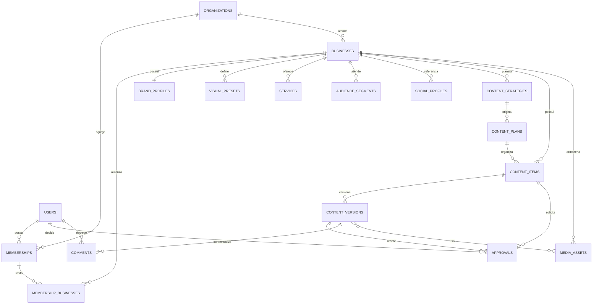
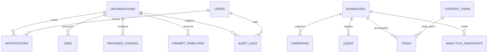

# Modelo de dados da versão 1.0

## 1. Objetivos do modelo

O modelo deve garantir no banco, além da aplicação:

- isolamento por organização e, para clientes, por empresa;
- histórico de conteúdo sem sobrescrever o que foi revisado;
- aprovação vinculada à versão exata;
- rastreabilidade de mudanças e efeitos externos;
- operação com múltiplos providers;
- evolução por migrações, sem depender de dados sem estrutura;
- retenção e exclusão compatíveis com LGPD.

O diagrama é conceitual. Nomes finais de constraints e tipos físicos pertencem às migrations Alembic, que são a fonte de verdade do schema executável.

## 2. Convenções

- Tabelas e colunas usam `snake_case`; nomes são em inglês para manter consistência com código e bibliotecas.
- Chaves primárias usam UUID.
- Timestamps são `timestamptz` em UTC: `created_at`, `updated_at` e, quando necessário, `deleted_at`.
- Toda entidade de tenant possui `organization_id NOT NULL`, exceto entidades globais explicitamente listadas.
- Entidade pertencente a cliente possui também `business_id NOT NULL` quando não houver vínculo inequívoco por pai.
- Dinheiro, quando entrar em versão futura, usa decimal e moeda ISO; nunca `float`.
- Enums persistidos têm valores estáveis; renomear exige migration e compatibilidade.
- JSONB é usado somente para estruturas flexíveis e validadas por schema, não para esconder relacionamentos centrais.
- E-mail é normalizado para busca/unicidade, preservando o valor de exibição quando necessário.
- Exclusão lógica não é padrão universal. Ela é aplicada quando histórico/recuperação justificam e suas queries devem filtrar `deleted_at` de forma centralizada.

## 3. Limites de acesso

Há dois limites complementares:

1. **Organização (`organization_id`):** tenant principal. Nenhuma consulta comum atravessa esse limite.
2. **Empresa (`business_id`):** recorte de cliente. Pessoas da agência podem receber acesso a várias empresas; pessoas cliente recebem apenas empresas explicitamente vinculadas.

`memberships` vincula usuário e organização. `membership_businesses` limita a membership às empresas autorizadas. Papéis de agência com escopo de toda a organização podem ter `all_businesses = true`; papéis de cliente não podem.

Para reduzir referência cruzada acidental, tabelas críticas expõem unicidade composta `(organization_id, id)`, e chaves estrangeiras carregam `organization_id` junto do identificador do pai. O repositório ainda deve aplicar o escopo em toda query.

## 4. Visão geral dos relacionamentos

## 5. Identidade e tenancy

### `users` — global

Pessoa autenticável, independente de tenant.

Campos essenciais:

- `id`, `email`, `email_normalized`, `display_name`;
- `password_hash` (nunca a senha), `is_active`, `email_verified_at`;
- `last_login_at`, timestamps.

Regras:

- unicidade global de `email_normalized` para a 1.0;
- desativar usuário invalida novas sessões, sem apagar sua autoria histórica;
- dados de autenticação nunca são copiados para audit log.

### `organizations`

Tenant principal da operação.

Campos: `id`, `name`, `slug`, `status`, `timezone`, `locale`, timestamps e `deleted_at` quando arquivado.

Regras: `slug` único entre organizações ativas; fuso padrão inicial `America/Sao_Paulo`, mas datas persistidas em UTC.

### `memberships`

Vínculo entre usuário e organização.

Campos: `id`, `organization_id`, `user_id`, `role`, `status`, `all_businesses`, `invited_by_user_id`, `joined_at`, timestamps.

Enums:

- `role`: `SUPER_ADMIN`, `AGENCY_ADMIN`, `STRATEGIST`, `CONTENT_EDITOR`, `DESIGNER`, `CLIENT_OWNER`, `CLIENT_REVIEWER`, `VIEWER`;
- `status`: `INVITED`, `ACTIVE`, `SUSPENDED`, `REVOKED`.

Regras:

- uma membership ativa por `(organization_id, user_id)`;
- papéis `CLIENT_OWNER`, `CLIENT_REVIEWER` e `VIEWER` de cliente exigem pelo menos um vínculo em `membership_businesses` e `all_businesses = false`;
- toda alteração de papel, escopo ou estado é auditada.

`SUPER_ADMIN` deve ser tratado como papel de plataforma e não concedido por um administrador comum de organização.

### `membership_businesses`

Associação de escopo entre membership e empresa.

Campos: `organization_id`, `membership_id`, `business_id`, `created_at`, `created_by_user_id`.

Chave única: `(membership_id, business_id)`. As FKs compostas garantem que membership e empresa pertencem à mesma organização.

### `organization_invites`

Convite de uso único.

Campos: `id`, `organization_id`, `business_id` opcional, `email_normalized`, `role`, `token_hash`, `expires_at`, `accepted_at`, `revoked_at`, `invited_by_user_id`.

O token puro existe apenas no envio; o banco guarda hash. Convites expirados ou revogados não podem ser reutilizados.

### `password_reset_tokens`

Solicitação de redefinição vinculada ao usuário e à organização usada para
auditoria. Guarda somente hash, validade, consumo e revogação. A troca válida
incrementa `users.session_version`, invalidando sessões emitidas antes dela.

### `user_sessions`

Sessão revogável/rotacionável.

Campos: `id`, `user_id`, `token_hash` ou identificador de refresh, `expires_at`, `last_seen_at`, `revoked_at`, metadados mínimos de dispositivo e timestamps.

Dados de IP/user-agent devem ter finalidade, retenção limitada e acesso restrito.

## 6. Cliente e identidade de marca

### `businesses`

Empresa cliente dentro de uma organização.

Campos: `id`, `organization_id`, `legal_name`, `public_name`, `segment`, `description`, `status`, `onboarding_status`, `timezone`, contatos básicos, timestamps e `deleted_at`.

`status`: `ACTIVE`, `INACTIVE`, `ARCHIVED`. Arquivar não remove conteúdo, decisões ou audit log.

### `brand_profiles`

Brand Kit principal; relação 1:1 com `businesses` na 1.0.

Campos estruturados:

- `organization_id`, `business_id`, `brand_name`, `public_name`, `description`, `segment`, `slogan`, `tone_of_voice`;
- `primary_colors`, `secondary_colors`, `fonts`;
- `preferred_words`, `forbidden_words`, `hashtags`, `default_ctas`;
- `differentiators`, `products`, `contacts`, `address`, `links`;
- `required_terms`, `forbidden_terms`, `legal_rules`, `image_restrictions`;
- `approved_examples`, `rejected_examples`, `visual_references`, `competitors`;
- `internal_notes`, `version`, timestamps.

Listas flexíveis podem ser JSONB validados. Serviços e públicos, por terem identidade e uso próprios, ficam em tabelas separadas. Alterações que afetam conteúdo em revisão são auditadas e não mudam retroativamente o snapshot de uma versão.

### `visual_presets`

Campos: `id`, tenant/empresa, `name`, `objective`, `format`, `aspect_ratio`, `creation_mode`, paleta, fontes, logo/posição/tamanho, margens, fundo, fotografia, realismo, iluminação, composição, regras de texto, `base_prompt`, `negative_prompt`, permitidos/proibidos, assinatura, CTA, `is_active`, `version`, timestamps.

`creation_mode`: `TEMPLATE`, `AI_IMAGE`, `HYBRID`, `MANUAL`.

Referências de mídia usam uma tabela associativa com `media_assets`, sem guardar binário ou URL permanente dentro do preset.

### `services`

Serviços/produtos promovidos. Campos: tenant/empresa, `name`, `description`, `category`, `is_active`, regras/avisos e timestamps.

### `audience_segments`

Públicos da empresa. Campos: tenant/empresa, `name`, `description`, necessidades, objeções, localização, `is_active` e timestamps. Não armazenar dado pessoal de indivíduo nesta entidade.

### `social_profiles`

Referência manual a perfis sociais na 1.0: plataforma, nome público, URL/handle e status. Não contém senha nem token. Conexões OAuth futuras devem usar entidade própria e cofre de segredos.

## 7. Estratégia, planejamento e conteúdo

### `content_strategies`

Campos: tenant/empresa, `name`, `objective`, `positioning`, funil, canais, pilares, indicadores planejados, período, `status`, origem/provider, autor, timestamps.

Estados sugeridos: `DRAFT`, `INTERNAL_REVIEW`, `CLIENT_REVIEW`, `APPROVED`, `ARCHIVED`. Estratégia aprovada é versionada ou copiada antes de alteração material.

### `strategy_versions`

Snapshot numerado e imutável da estratégia, incluindo direção, funil, canais,
pilares, indicadores e snapshots de marca/catálogos. `content_strategies`
mantém referências separadas para a versão atual e a aprovada.

### `content_plans`

Calendário/plano de um período. Campos: tenant/empresa, `strategy_id`, `name`, `starts_on`, `ends_on`, frequência, status, autor e timestamps.

Uma data sugerida no conteúdo é planejamento; só vira registro de publicação quando explicitamente marcado.

### `calendar_entries`

Pautas por plano com data/hora sugerida, canal, formato, objetivo, público,
preset e vínculo opcional ao conteúdo gerado. Consultas por intervalo permitem
as visões mensal e semanal sem duplicar registros.

### `content_items`

Raiz do agregado editorial.

Campos:

- `id`, `organization_id`, `business_id`, `content_plan_id` opcional;
- estratégia, versão da estratégia, pauta e preset opcionais;
- `status` oficial;
- `current_version_id`;
- `scheduled_for`, `published_at`, `publication_reference` manual;
- `created_by_user_id`, `assigned_to_user_id`, `sensitivity`, timestamps e `archived_at`.

Estados oficiais: `DRAFT`, `INTERNAL_REVIEW`, `CLIENT_REVIEW`, `CHANGES_REQUESTED`, `APPROVED`, `SCHEDULED`, `PUBLISHED`, `FAILED`, `ARCHIVED`.

Regras:

- `current_version_id` deve apontar para versão do mesmo conteúdo/tenant;
- `published_at` só existe em `PUBLISHED` e representa registro manual na 1.0;
- `sensitivity = HEALTH_OR_VETERINARY` exige revisão profissional antes de `APPROVED`;
- toda transição passa por política de domínio e audit log.

### `content_versions`

Snapshot imutável do conteúdo revisável.

Campos:

- tenant/empresa, `content_item_id`, `version_number`;
- `title`, `caption`, `network`, `format`, `suggested_date`;
- `objective`, `audience_snapshot`, `cta`, `notes`;
- roteiro, prompt visual e `brand_context_snapshot` sanitizado;
- `source` (`MANUAL`, `MOCK`, `HERMES`, `REMOTE`), `provider_name`, `prompt_template_version`;
- `created_by_user_id`, `created_at`, `supersedes_version_id`.

Constraints: único `(content_item_id, version_number)`. Depois de submetida para revisão, a versão não é alterada; nova edição cria a próxima versão.

`notes`, prompts, snapshots de contexto e identificadores de autoria são campos
internos. Os DTOs do portal cliente omitem esses campos tanto no conteúdo quanto
em presets aninhados; não basta escondê-los na interface.

### `media_assets` e `content_version_media`

`media_assets` guarda tenant/empresa, tipo, storage provider, object key, MIME detectado, bytes, checksum, dimensões, origem, status de processamento, autor e timestamps.

Não guardar URL assinada: ela expira e é produzida sob demanda. `content_version_media` relaciona uma versão a mídias com papel (`PRIMARY`, `REFERENCE`, `BACKGROUND`, `OUTPUT`) e ordem.

## 8. Aprovações e colaboração

### `approvals`

Pedido e decisão de uma etapa de revisão.

Campos:

- tenant/empresa, `content_item_id`, `content_version_id`;
- `stage`: `INTERNAL` ou `CLIENT`;
- `component`: `TEXT` ou `IMAGE`;
- `status`: `PENDING`, `APPROVED`, `CHANGES_REQUESTED`, `REJECTED`, `CANCELLED`;
- `requested_by_user_id`, `requested_at`, `assigned_membership_id` opcional;
- `decided_by_user_id`, `decided_at`, `reason`, timestamps.

Regras:

- apenas uma solicitação por versão/etapa/componente;
- decisão é permitida somente a membership ativa com papel e empresa adequados;
- `CHANGES_REQUESTED` e `REJECTED` exigem justificativa;
- uma versão nova cancela pendências obsoletas da anterior, mas nunca apaga decisões;
- aprovação final refere-se à versão e não autoriza publicação automática.

### `comments`

Campos: tenant/empresa, `content_item_id`, `content_version_id` opcional, `author_user_id`, `body`, `visibility` (`INTERNAL`, `CLIENT_VISIBLE`), timestamps e `deleted_at` controlado.

Comentários editados devem registrar auditoria; comentários internos nunca são devolvidos por endpoints do portal cliente.

## 9. Notificações e preferências

### `notifications`

Notificação interna individual.

Campos: `id`, `organization_id`, `business_id` opcional, `recipient_user_id`, `type`, `importance`, título/mensagem segura, `resource_type`, `resource_id`, `read_at`, `created_at`.

Índice principal: `(recipient_user_id, read_at, created_at DESC)` dentro da organização. Contador é calculado por registros não lidos; não depende da entrega de e-mail.

### `notification_preferences`

Preferências por membership: frequência (`IMMEDIATE`, `DAILY`, `WEEKLY`, `IMPORTANT_ONLY`), e-mail habilitado, lembrete, fuso e horário de resumo. Alertas legais/segurança podem ter regras próprias claramente informadas.

Tentativas de canal externo são jobs e, quando necessário, possuem `notification_deliveries` com provider, estado, tentativas e erro sanitizado.

## 10. Providers, prompts e jobs

### `provider_configs`

Campos: tenant, `provider_type`, `provider_name`, capacidades, `is_enabled`, prioridade, limites/política de custo, configuração não secreta, `secret_reference`, `last_tested_at`, status e timestamps.

Segredos não ficam em JSONB comum. `secret_reference` aponta para secret manager ou valor cifrado por mecanismo de infraestrutura. Respostas da API sempre mascaram dados sensíveis.

### `prompt_templates`

Template versionado por tarefa. Campos: tenant opcional para template de sistema, `key`, `version`, finalidade, conteúdo, schema de entrada/saída, `is_active`, autor e timestamps.

Uma geração registra a versão usada; alterar um template cria versão, preservando reprodutibilidade.

### `jobs`

Campos: tenant, `type`, `status`, payload mínimo, `idempotency_key`, `attempts`, `max_attempts`, `available_at`, `locked_at`, `locked_by`, `timeout_at`, resultado/erro sanitizado e timestamps.

Para e-mails operacionais, o payload guarda somente `notification_id`. O worker
reconsulta a notificação, o usuário e uma membership ativa na mesma organização
e empresa antes de resolver o endereço e o corpo da mensagem. E-mail, corpo,
comentário e conteúdo não são copiados para o payload do job.

Estados: `PENDING`, `RUNNING`, `RETRY_SCHEDULED`, `SUCCEEDED`, `FAILED`, `CANCELLED`.

Índices: parcial/composto para jobs elegíveis por `(status, available_at)` e único por `(organization_id, idempotency_key)` quando a chave existir.

## 11. Auditoria

### `audit_logs`

Registro append-only.

Campos:

- `id`, `organization_id`, `business_id` opcional;
- `actor_user_id` opcional para ação de sistema, `actor_type` (`USER`, `SYSTEM`, `WORKER`);
- `action`, `resource_type`, `resource_id`;
- `outcome`, `occurred_at`, `request_id`, `correlation_id`;
- `changes` e `metadata` com lista permitida e dados sanitizados;
- IP/user-agent reduzidos quando houver finalidade documentada.

Não existe endpoint comum de update/delete. Retenção e eventual anonimização seguem política legal sem apagar a prova necessária. Segredos, senha, cookie, token, conteúdo clínico e payload integral de provider são proibidos.

Eventos mínimos:

- login com sucesso/falha relevante, logout/revogação e recuperação;
- criação/edição/arquivamento de organização, membership, empresa e Brand Kit;
- mudança de papel ou escopo;
- criação de conteúdo/versão e chamada de provider;
- cada transição de conteúdo, solicitação e decisão de aprovação;
- marcação manual de publicação;
- configuração/teste de provider;
- upload/remoção de mídia e conexão/desconexão futura de integração.

## 12. Entidades previstas no modelo inicial ampliado

Estas entidades são documentadas para preservar a evolução, mas não precisam entrar na primeira migration do fluxo vertical:

| Entidade | Uso | Momento |
| --- | --- | --- |
| `campaigns` | Agrupa objetivo, período e conteúdos; na 1.0 não representa campanha paga real | 1.0 completa/1.1 |
| `leads` | Pessoas interessadas, consentimentos e estágio | 2.5 |
| `tasks` | Trabalho interno e recorrências | 1.1 |
| `analytics_snapshots` | Métricas importadas/manuais com período, fonte e qualidade | 1.0 básico/2.0 automático |
| `integration_connections` | Estado OAuth, escopos, conta externa e referência secreta | 2.0+ |
| `integration_sync_runs` | Histórico de sincronização, cursor, erro e tentativas | 2.0+ |
| `campaign_budget_approvals` | Limite e aprovação financeira explícita | 3.0 |

Criar tabelas futuras vazias sem caso de uso aumenta custo e não é requisito. O compromisso da 1.0 é não bloquear sua adição e manter integrações fora do domínio central por adaptadores.

## 13. Constraints e índices mínimos

- unicidade de usuário por e-mail normalizado;
- unicidade de membership por organização/usuário;
- unicidade de Brand Kit por organização/empresa;
- unicidade de versão por conteúdo/número;
- unicidade de solicitação de aprovação pendente por etapa e versão;
- FKs compostas com organização nas relações críticas;
- índices por `(organization_id, business_id)` nas listas de tenant;
- índice por conteúdo/status/data para calendário e pendências;
- índice por destinatário/leitura em notificações;
- índice por recurso/data em audit log;
- índice de jobs elegíveis;
- checks coerentes, por exemplo decisão exige `decided_at` e `decided_by_user_id`.

O desempenho deve ser verificado com `EXPLAIN` e volume representativo antes de adicionar índices especulativos.

## 14. Concorrência e idempotência

- Entidades editáveis podem usar coluna `version` para controle otimista; conflito retorna erro tratável e não sobrescreve silenciosamente.
- A decisão de aprovação bloqueia/revalida conteúdo, versão atual, solicitação pendente e papel na mesma transação.
- A criação de notificação/audit/job ocorre junto da mudança principal ou por padrão outbox equivalente.
- Repetir a mesma decisão com a mesma chave de idempotência devolve o resultado anterior; uma decisão incompatível retorna conflito.
- Worker usa lease e `FOR UPDATE SKIP LOCKED`; job abandonado pode ser recuperado após timeout.

## 15. Classificação, retenção e LGPD

| Classe | Exemplos | Tratamento |
| --- | --- | --- |
| Pública | nome público, links públicos da marca | Ainda limitada ao uso previsto; pode aparecer no conteúdo |
| Interna | estratégia, notas internas, prompts, custos | Acesso da equipe conforme papel; nunca no portal por padrão |
| Pessoal | nome, e-mail, comentários, logs de acesso | Minimização, finalidade, retenção e atendimento a direitos |
| Secreta | senha hash, tokens, credenciais de provider | Criptografia/referência segura, mascaramento e acesso mínimo |
| Sensível/proibida no marketing | informação clínica individual | Não coletar no fluxo de conteúdo; remover/escalar se recebida |

A política operacional deve definir períodos de retenção antes da produção. Exclusão de uma pessoa deve preservar referências legais/auditoria de forma anonimizada quando necessário. Dados de um cliente não são usados para treinar ou sugerir para outro sem consentimento explícito e registro dessa finalidade.

## 16. Seeds e dados de demonstração

Seeds locais devem criar dados claramente fictícios:

- organização DevMark Demo;
- clínica veterinária fictícia;
- usuário administrador, editor e revisor cliente;
- Brand Kit e conteúdo mock;
- nenhuma chave real, e-mail de cliente real ou informação clínica.

Seeds são idempotentes e nunca executados automaticamente em produção.
