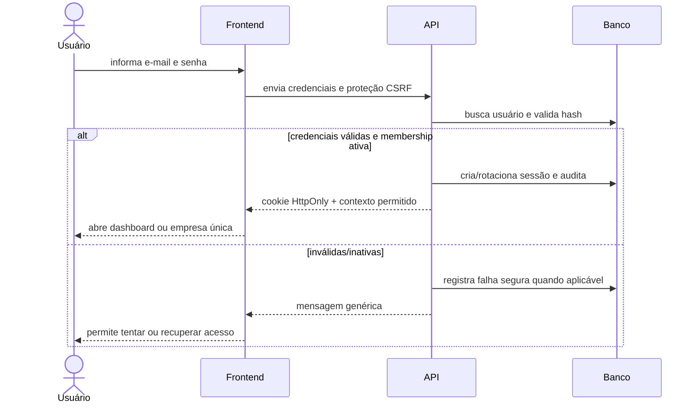
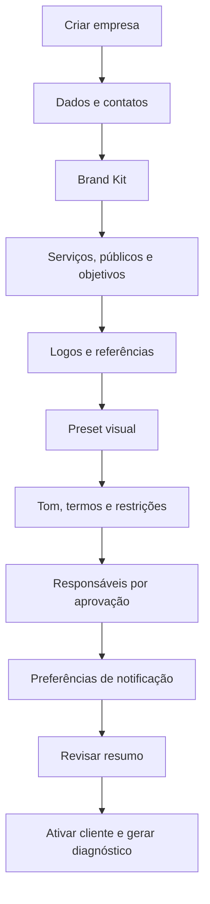
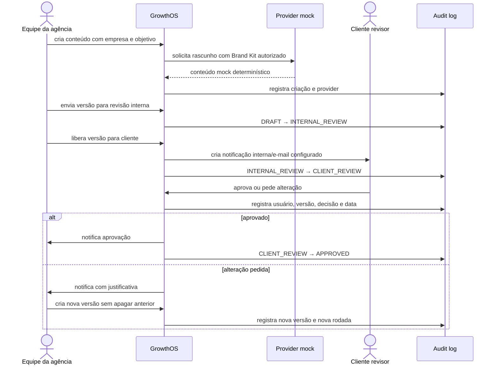
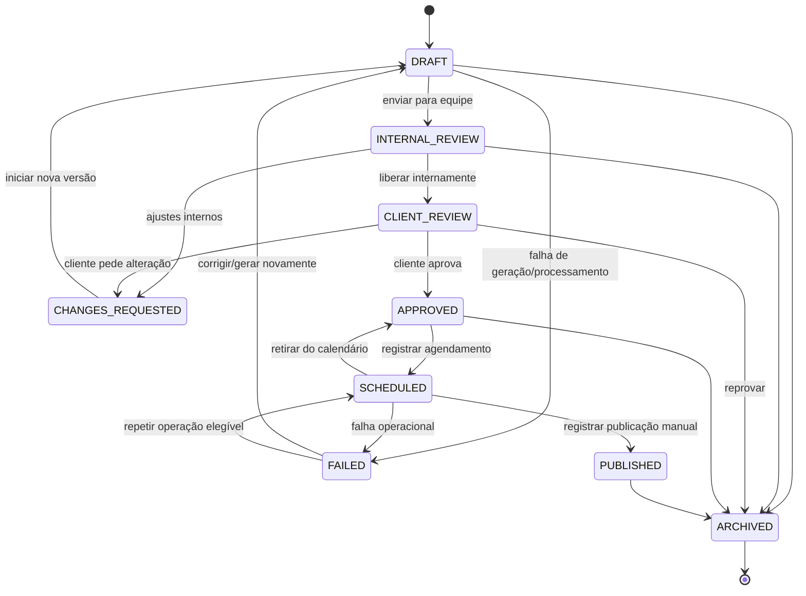

# Fluxos e experiência do usuário

## 1. Direção de experiência

O GrowthOS atende pessoas que não precisam conhecer detalhes técnicos. A interface deve dizer o que aconteceu, o que precisa de atenção e qual é o próximo passo. O portal do cliente prioriza celular e aprovação em poucos toques; o painel da agência prioriza contexto e segurança operacional.

Regras comuns:

- uma ação principal visível por tela;
- linguagem em português do Brasil e termos técnicos traduzidos;
- estados de carregamento, vazio, sucesso e falha em todo fluxo;
- confirmação para ação destrutiva e possibilidade de desfazer quando segura;
- feedback imediato; jobs longos mostram progresso consultável;
- contagem de pendências no menu e atalho **Revisar aprovações**;
- histórico e versão anterior acessíveis sem poluir a ação principal;
- acessibilidade por teclado, foco visível, rótulos, contraste e mensagens anunciáveis;
- autorização real no backend; esconder um botão não é controle de acesso.

## 2. Entradas e navegação

### Agência

Login, Dashboard, Clientes, Novo cliente, Perfil da marca, Brand Kit, Presets visuais, Serviços, Públicos, Estratégias, Calendário, Conteúdos, Editor, Mídia, Aprovações, Comentários, Notificações, Relatórios, Provedores de IA, Configurações e Logs.

No primeiro ciclo, a navegação pode mostrar apenas módulos já conectados. Itens futuros não devem parecer funcionais.

### Cliente

Login, Início, Pendências, Aprovações, Calendário, Conteúdos aprovados, Resultados, Notificações, Marca, Preferências e Usuários.

A tela inicial destaca:

- quantidade aguardando decisão;
- botão **Revisar aprovações**;
- próximo conteúdo e calendário da semana;
- notificações e mensagens da equipe;
- resultados disponíveis, com estado vazio honesto quando não há dados.

## 3. Login e seleção de contexto

Se houver várias organizações/empresas permitidas, a seleção exibe apenas opções retornadas pelo backend. A troca de contexto renova o contexto autorizado; IDs recebidos da interface nunca são aceitos sem revalidação.

## 4. Onboarding de cliente

O sistema salva rascunho entre etapas. Um checklist mostra itens concluídos e o efeito dos campos. Para a primeira fatia vertical, Brand Kit básico é suficiente; campos ainda ausentes aparecem como pendência, não são inventados pelo provider.

Conteúdo veterinário/saúde ativa a regra de revisão profissional e explica, em linguagem simples, por que essa confirmação é necessária.

## 5. Fluxo vertical de conteúdo e aprovação

### Cartão/tela de aprovação

Deve mostrar, antes dos botões:

- preview visual e legenda;
- rede, formato e data sugerida;
- objetivo, público e CTA;
- observações e sinalização de conteúdo sensível;
- versão atual e acesso ao histórico;
- comentários visíveis ao cliente.

Ações:

- **Aprovar:** confirmação curta e decisão sobre a versão exibida;
- **Pedir alteração:** abre campo obrigatório e exemplos do tipo de feedback útil;
- **Reprovar:** exige motivo e informa que o item sairá das pendências;
- **Salvar para depois:** não muda o estado e apenas mantém a pendência.

Se outra pessoa decidir enquanto a tela está aberta, a API retorna conflito e a tela recarrega a decisão atual; não registra uma segunda decisão contraditória.

## 6. Máquina de estados do conteúdo

| Origem | Ação | Destino | Quem pode | Efeito adicional |
| --- | --- | --- | --- | --- |
| `DRAFT` | Enviar para revisão | `INTERNAL_REVIEW` | Editor/estrategista autorizado | Congela a versão submetida |
| `INTERNAL_REVIEW` | Liberar | `CLIENT_REVIEW` | Revisor interno autorizado | Cria aprovação e notifica cliente |
| `INTERNAL_REVIEW` | Pedir ajuste | `CHANGES_REQUESTED` | Revisor interno | Motivo obrigatório e notificação |
| `CLIENT_REVIEW` | Aprovar | `APPROVED` | Owner/reviewer cliente | Registra decisão da versão e notifica agência |
| `CLIENT_REVIEW` | Pedir ajuste | `CHANGES_REQUESTED` | Owner/reviewer cliente | Motivo obrigatório; versão preservada |
| `CLIENT_REVIEW` | Reprovar | `ARCHIVED` | Owner/reviewer cliente | Decisão `REJECTED`, motivo e auditoria |
| `CLIENT_REVIEW` | Salvar para depois | sem mudança | Owner/reviewer cliente | Mantém pendência; pode registrar preferência |
| `CHANGES_REQUESTED` | Iniciar ajuste | `DRAFT` | Editor autorizado | Cria nova versão a partir da anterior |
| `APPROVED` | Agendar manualmente | `SCHEDULED` | Equipe autorizada | Registra data; não publica externamente |
| `SCHEDULED` | Marcar como publicado | `PUBLISHED` | Equipe autorizada | Registra ator/data/referência manual |
| elegível | Arquivar | `ARCHIVED` | Papel autorizado | Confirmação e audit log |

Para conteúdo veterinário/saúde, a transição final para `APPROVED` só ocorre quando a revisão profissional exigida estiver registrada. Reabrir um aprovado para edição cria nova versão e nova rodada; a aprovação anterior permanece histórica.

## 7. Pedido de alteração e versão nova

1. Revisor informa uma justificativa objetiva.
2. O conteúdo passa a `CHANGES_REQUESTED`; a versão decidida fica imutável.
3. Editor escolhe **Criar nova versão** e vê o feedback ao lado.
4. O sistema copia os campos editáveis para a nova versão e muda o item para `DRAFT`.
5. A nova versão percorre revisão interna novamente.
6. Cliente recebe nova pendência com indicação “versão 2” e pode comparar com a anterior.

Não há edição silenciosa de uma versão em `CLIENT_REVIEW` ou já decidida.

## 8. Notificações

| Evento | Destinatário | Canal mínimo | Urgência padrão |
| --- | --- | --- | --- |
| Conteúdo liberado ao cliente | Revisores da empresa | Interno; e-mail conforme preferência | Normal ou imediata se marcado urgente |
| Alteração solicitada | Responsável interno | Interno + e-mail configurado | Imediata |
| Conteúdo aprovado/reprovado | Responsável interno | Interno | Normal |
| Nova versão disponível | Cliente que decidiu/está atribuído | Interno; e-mail conforme preferência | Normal |
| Job falhou definitivamente | Administrador/equipe responsável | Interno | Importante |
| Convite criado | Pessoa convidada | E-mail | Imediata |

O registro interno é a fonte de verdade e não depende do sucesso do e-mail. Preferências aceitas: imediato, resumo diário, semanal e somente importante. Contagem de pendências usa aprovações pendentes, não apenas notificações não lidas.

## 9. Calendário e publicação manual

- `APPROVED` pode receber uma data e virar `SCHEDULED`.
- O calendário diferencia sugerido, aprovado e publicado por texto/ícone, não só por cor.
- Arrastar ou editar uma data exige permissão e registra a mudança.
- Na 1.0, **Marcar como publicado** solicita data e referência opcional; não chama rede social.
- Falha ou ausência de uma publicação real não é escondida como sucesso.

## 10. Estados vazios e falhas

| Situação | Mensagem/ação esperada |
| --- | --- |
| Sem cliente | Explicar que o primeiro passo é cadastrar uma empresa; botão **Novo cliente** |
| Brand Kit incompleto | Listar campos úteis que faltam; permitir continuar com aviso quando seguro |
| Sem pendências | Confirmar que está tudo revisado e mostrar próximo conteúdo |
| Sem resultado | Informar que métricas ainda não foram registradas; não mostrar números fictícios |
| Provider indisponível | Preservar dados, mostrar tentativa e oferecer mock/novo envio se autorizado |
| Sessão expirada | Salvar rascunho local seguro quando possível e pedir novo login |
| Acesso negado | Não revelar dados do recurso; orientar troca de contexto/contato com administrador |
| Conflito de versão | Informar que houve atualização e recarregar sem sobrescrever |

## 11. Critérios de UX do fluxo vertical

- Cliente chega da notificação à versão correta.
- Em viewport móvel, preview, resumo e decisão são legíveis sem zoom horizontal.
- A ação principal é alcançável por teclado e leitor de tela.
- Pedido de alteração não pode ser enviado sem motivo.
- Depois da decisão, a tela mostra estado, versão, pessoa e horário.
- Voltar/recarregar não duplica decisão ou notificação.
- Usuário de outra empresa recebe negação segura mesmo conhecendo a URL.
- Operação demorada não bloqueia a página e tem estado consultável.

## 12. Limites da versão 1.0

Não haverá botão que publique automaticamente, altere campanha paga ou envie WhatsApp real. Integrações futuras podem aparecer em um Centro de Integrações como indisponíveis/desconectadas apenas quando isso ajudar a configuração; nunca devem simular sucesso.

