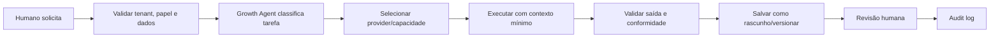
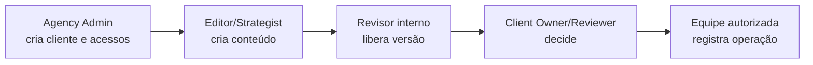

# Agentes, papéis e responsabilidades

## 1. Duas classes diferentes de atores

No GrowthOS, **agente de IA** é um componente automatizado que propõe ou processa trabalho. **Papel de usuário** é uma autorização concedida a uma pessoa. Um agente nunca herda implicitamente o poder de um usuário e nunca substitui aprovação humana obrigatória.

O Growth Agent coordena capacidades. As decisões de negócio continuam em casos de uso determinísticos, com validação de permissões, transições e auditoria no backend.

## 2. Ciclo seguro de uma tarefa de IA

O agente recebe somente dados da organização/empresa autorizada e necessários à tarefa. A saída nasce como rascunho. Nenhuma saída publica, gasta, envia campanha em massa ou fornece orientação veterinária sem a revisão exigida.

## 3. Agentes da visão do produto

| Agente | Responsabilidade | Situação na 1.0 | Limites essenciais |
| --- | --- | --- | --- |
| **Growth Agent** | Orquestrar tarefas, prioridade, provider, custo e resultado | Orquestração simples por regras e providers | Não contorna caso de uso, autorização ou aprovação |
| **Audit Agent** | Avaliar presença digital e gerar diagnóstico | Diagnóstico inicial manual/mock | Sem coleta não autorizada ou login por senha externa |
| **Strategy Agent** | Sugerir público, posicionamento, objetivos, funil, calendário e indicadores | Rascunho de estratégia | Não apresenta hipótese como dado medido |
| **Content Agent** | Gerar ideias, legendas, carrosséis, stories, roteiros e CTA | Ativo com mock e providers opcionais | Resultado sempre versionado e revisável |
| **Visual Agent** | Conceito visual, imagem-base, template e variações | Contrato, template/upload e mock; provider opcional | Texto/logo final preferencialmente determinísticos |
| **Video Agent** | Roteiro, storyboard, cenas, tela, narração e prompts | Apenas planejamento e upload | Geração automática de vídeo fora da 1.0 |
| **Ads Agent** | Planejar anúncios, criativos, orçamento e análise | Somente ideias/contratos futuros | Não cria campanha real nem altera gasto |
| **CRM Agent** | Organizar leads, segmentos e follow-up | Fora da 1.0 | Sem mensagem em massa ou uso sem consentimento |
| **Customer Service Agent** | Classificar mensagens e sugerir respostas | Fora da 1.0 | Não responde automaticamente nem orienta saúde |
| **Analytics Agent** | Ler métricas, comparar períodos e recomendar | Relatório básico com dados manuais | Não inventa métricas nem acessa fonte desconectada |
| **Compliance Agent** | Aplicar regras de marca, risco e revisão profissional | Regras determinísticas básicas | Sinaliza risco; não substitui profissional/legal |
| **Development Agent** | Planejar landing pages, integrações e automações | Fora do fluxo vertical | Não altera/deploya sistemas por iniciativa própria |

“Fora da 1.0” significa que não há execução funcional. Interfaces futuras podem ser documentadas, sem telas falsas ou integrações ativas.

## 4. Growth Agent e roteamento de providers

O Growth Agent decide por capacidade e política, não por SDK espalhado no domínio.

| Tipo de tarefa | Preferência | Alternativa | Regra |
| --- | --- | --- | --- |
| Classificar, resumir, etiquetar, transformar | Hermes/Ollama local quando autorizado | Mock ou remoto configurado | Priorizar baixo custo e privacidade |
| Rascunho repetível em desenvolvimento/teste | Provider mock | Nenhuma necessária | Saída determinística, sem rede |
| Estratégia complexa ou texto final importante | Remoto configurável | Hermes se qualidade/política permitir | Exige configuração e revisão humana |
| Conteúdo sensível | Provider aprovado + Compliance | Trabalho manual | Nunca dispensar revisão profissional |
| Imagem | Template/Hybrid recomendado | AI image ou upload | Texto final aplicado deterministicamente |
| Notificação | Interna primeiro | E-mail configurado | Falha de e-mail não perde pendência |

Cada execução registra organização, empresa, tarefa, provider lógico, versão de prompt, duração, estado e erro sanitizado. Não registra credencial nem raciocínio interno. Fallback remoto só ocorre com autorização explícita da configuração.

## 5. Responsabilidade humana por papel

### `SUPER_ADMIN`

Administração excepcional da plataforma. Pode atuar entre organizações apenas para suporte autorizado. Toda ação é fortemente auditada; não é um papel concedido por cliente ou agência comum.

### `AGENCY_ADMIN`

Administra operação, membros, clientes, escopos, providers e configurações da organização. Pode ver audit log da organização. Não pode revelar segredos nem agir fora dela.

### `STRATEGIST`

Cria e revisa estratégias, objetivos, públicos, planos e calendários. Pode participar da revisão interna, mas não administra credenciais ou permissões.

### `CONTENT_EDITOR`

Cria conteúdo, versões, legendas, roteiros e comentários internos; submete para revisão. Não aprova em nome do cliente.

### `DESIGNER`

Gerencia presets, mídia e atributos visuais. Pode editar a parte visual de rascunhos autorizados. Não altera usuários, providers secretos ou decisão do cliente.

### `CLIENT_OWNER`

Administra usuários cliente da própria empresa quando a política permitir, consulta informações da marca e decide aprovações. Não vê notas internas nem outras empresas.

### `CLIENT_REVIEWER`

Revisa, comenta, aprova, pede alteração ou reprova conteúdo da empresa vinculada. Não administra a organização nem edita o rascunho da agência.

### `VIEWER`

Consulta recursos liberados no seu escopo. Não cria, edita, comenta com efeito decisório, aprova ou configura.

## 6. Matriz de permissões da 1.0

Legenda: `A` administra; `E` edita/executa; `R` revisa/decide; `V` visualiza; `—` não permitido. Toda célula continua limitada à organização e às empresas vinculadas.

| Recurso/ação | SUPER_ADMIN | AGENCY_ADMIN | STRATEGIST | CONTENT_EDITOR | DESIGNER | CLIENT_OWNER | CLIENT_REVIEWER | VIEWER |
| --- | --- | --- | --- | --- | --- | --- | --- | --- |
| Organização | A | E/V | V | V | V | V limitada | V limitada | V limitada |
| Membros e papéis | A | A | — | — | — | E cliente | — | — |
| Empresa cliente | A | A | E/V | V | V | V própria | V própria | V própria |
| Brand Kit/serviços/públicos | A | A | E | E | E visual | V/comentário | V | V |
| Estratégia/calendário | A | A | E/R | E | V | R/V quando enviado | R/V quando enviado | V liberado |
| Conteúdo e versões | A | A | E | E | E visual | R/V | R/V | V liberado |
| Revisão interna | A | R | R | Envia/ajusta | Envia/ajusta visual | — | — | — |
| Decisão do cliente | Suporte auditado | Não em nome do cliente | — | — | — | R | R | — |
| Mídia e presets | A | A | V | V/E ligada | E | V | V | V liberado |
| Publicação manual | A | E | E conforme política | E conforme política | — | V | V | V |
| Providers/segredos | A | A mascarado | V configuração permitida | — | — | — | — | — |
| Audit log | A | V | V das ações permitidas | V próprio/recurso | V próprio/recurso | V histórico cliente permitido | V histórico cliente permitido | — |

A matriz é o padrão inicial. Permissões finas podem ser adicionadas depois, mas nunca ampliadas silenciosamente. Uma pessoa com dois vínculos recebe a união apenas dentro do mesmo contexto explicitamente selecionado.

## 7. Segregação de responsabilidades no fluxo vertical

Na clínica piloto, uma mesma pessoa interna pode acumular papéis se a equipe for pequena, mas o sistema registra qual capacidade autorizou a ação. A decisão do cliente não pode ser simulada por um editor. Suporte excepcional de `SUPER_ADMIN` exige justificativa e audit log.

## 8. Regras específicas de aprovação

- Revisor decide somente a versão atual apresentada.
- `CLIENT_REVIEWER` e `CLIENT_OWNER` precisam de vínculo ativo com a empresa.
- Pedido de alteração e reprovação exigem motivo.
- O autor pode submeter, mas a política da organização pode exigir outra pessoa na revisão interna.
- Conteúdo de saúde/veterinária exige marcação e confirmação de revisão profissional antes da aprovação final.
- Um agente pode sinalizar risco e sugerir correção; não registra a confirmação profissional.
- Aprovação de conteúdo não é aprovação de gasto nem autorização de publicação automática.

## 9. Responsabilidades de segurança e dados

Todos os agentes e papéis obedecem:

- contexto mínimo da organização/empresa;
- proibição de reutilizar dados entre clientes sem autorização;
- proibição de segredos em prompt, log ou resposta ao frontend;
- validação de saída antes de persistir/renderizar;
- audit log de ação relevante;
- interrupção segura quando não há autorização ou revisão exigida;
- nenhuma informação clínica individual no marketing;
- possibilidade de desativar provider e revogar sessão/acesso.

## 10. Falhas e escalonamento

O agente deve devolver estado compreensível, sem fingir conclusão:

- entrada insuficiente: indicar campos faltantes e preservar rascunho;
- provider indisponível: retry controlado ou mock apenas se a política permitir;
- saída fora do schema: rejeitar, registrar erro sanitizado e solicitar nova execução;
- conteúdo de risco: bloquear avanço e encaminhar à revisão humana;
- suspeita de acesso cruzado/segredo: não processar, registrar incidente operacional e avisar administrador;
- conflito de versão: recarregar a versão atual, sem sobrescrever decisão.

## 11. Critérios de aceite

- cada ação protegida tem teste positivo e negativo por papel;
- cliente nunca recebe comentário interno, provider secreto ou recurso de outra empresa;
- agente não altera estado editorial fora dos casos de uso permitidos;
- provider mock cobre o fluxo sem rede;
- execução e decisão humana ficam distinguíveis no audit log;
- conteúdo sensível não chega a `APPROVED` sem revisão exigida;
- nenhuma ação da 1.0 publica, responde ou gasta automaticamente.

